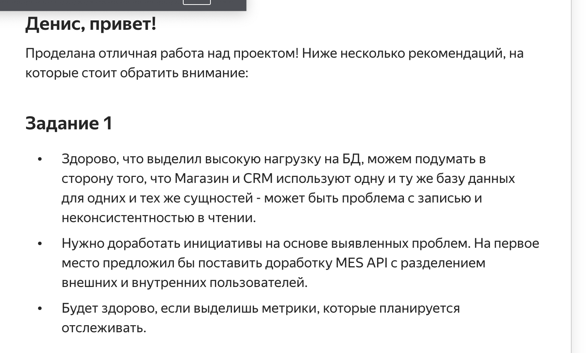
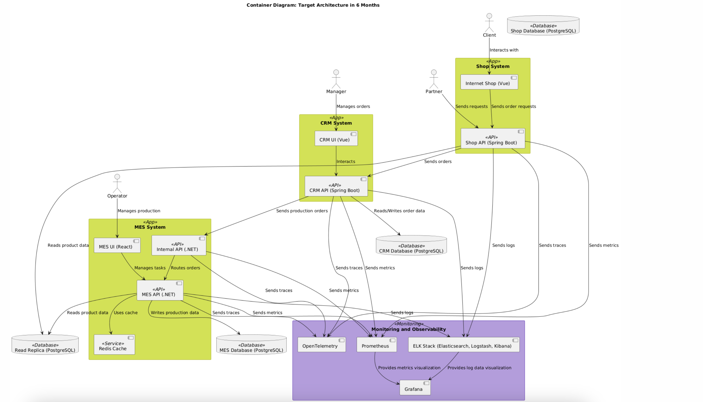

# Корректировка решения с учётом замечаний (исправленное)

---

правим по комментариям

---

## Проблемы в порядке приоритета (и типизацией)

### 1. Бизнес

1. **Долгий срок выполнения заказов, заведённых через интернет-магазин:**
   - Клиенты недовольны длительным ожиданием, что снижает их лояльность и количество повторных заказов.

2. **Долгий срок выполнения заказов через API:**
   - Партнёры жалуются на низкую скорость обработки, что подрывает доверие и снижает конкурентоспособность.

3. **Жалобы клиентов на задержки доставки заказов:**
   - Негативный клиентский опыт ухудшает репутацию компании и может привести к потере клиентов.

4. **Долгая загрузка списка заказов в приложении MES:**
   - Низкая производительность MES снижает эффективность работы операторов, замедляя выполнение заказов.

---

### 2. QA

5. **Функциональное тестирование проводится вручную:**
   - Ручное тестирование увеличивает вероятность пропуска дефектов, особенно в условиях высокой нагрузки.

6. **Проверки нефункциональных требований (например, работы под нагрузкой) не проводятся:**
   - Система может выйти из строя при пиковых нагрузках, что создаёт риски сбоев в бизнес-процессах.

7. **Отсутствие нагрузочного тестирования для MES:**
   - Система не проверяется на масштабируемость, что приводит к проблемам при росте числа пользователей.

---

### 3. Девопс

8. **Ручные операции при деплое в release и prod среды:**
   - Высокая вероятность ошибок из-за человеческого фактора замедляет выпуск новых функций.

9. **Отсутствие автоматизации в процессе CI/CD:**
   - Увеличивает время развертывания и риск ошибок при обновлениях.

---

### 4. Базы данных

10. **Базы данных имеют один инстанс для чтения и записи:**
    - Узкое место в архитектуре, мешающее масштабированию.

11. **Нет кэширования, из-за этого создаётся большая нагрузка на базы данных:**
    - Система теряет производительность, увеличивая время обработки запросов.

12. **Высокая нагрузка на базу данных во время расчёта стоимости заказов:**
    - Приводит к задержкам в выполнении операций и сбоям.

---

### 5. Наблюдаемость

13. **Нет инструментов для анализа причин бизнес-проблем на prod-среде:**
    - Сложно выявлять причины инцидентов, что увеличивает время их устранения.

14. **Отсутствие централизованного логирования:**
    - Диагностика ошибок затруднена, что приводит к увеличению времени решения инцидентов.

15. **Нет системы трейсинга:**
    - Невозможно отследить путь заказов через компоненты, что затрудняет поиск узких мест.

---

## Обоснование приоритета

### Новая структура для инициатив:

1. **MES API:** Разделение на внутренние и внешние потоки пользователей.
   - *Почему?* Разделение нагрузки ускорит работу API и устранит узкое место.

2. **Разделение базы данных для разных подсистем (Shop и CRM):**
   - *Почему?* Разделение поможет избежать неконсистентности при чтении и записи.

3. **Оптимизация MES:** 
   - Включение кэширования Redis для обработки заказов.

---

## Новые инициативы

### MES API
- **Что делать?** Разделение потоков пользователей в API на внутренние (операторы) и внешние (клиенты и партнёры).
- **Результат:** Снижение конкуренции за ресурсы и повышение производительности.

### База данных
- **Что делать?** Разделить базы данных для интернет-магазина и CRM.
- **Результат:** Устранение конфликта при чтении и записи.

---

## Уточнение метрик

### Метрики для API (Shop API, CRM API, MES API):
1. **RPS (Requests per Second):**
   - Для оценки нагрузки на API.
2. **Latency (Response Time):**
   - Среднее время обработки запросов.
3. **HTTP-коды (200, 400, 500):**
   - Успешные запросы, клиентские ошибки, серверные ошибки.
4. **Скорость обработки (Throughput):**
   - Количество запросов, обрабатываемых за единицу времени.
5. **Время первого байта (Time to First Byte):**
   - Задержка между отправкой запроса и получением первого ответа.

### Метрики для базы данных:
1. **Количество активных соединений по подсистемам.**
2. **Среднее время выполнения операций (Query Latency).**
3. **Процент использования ресурсов (CPU, RAM).**

---

## Итог

Учитывая замечания, скорректирован приоритет инициатив:
1. Разделение потоков MES API.
2. Разделение базы данных для Shop и CRM.
3. Оптимизация производительности MES через кэширование.

Эти инициативы первостепенны, так как они устраняют узкие места, влияющие на клиентский опыт и стабильность системы.

# Корректировка решения с учётом замечаний (что правил)

## 1. Корректировка инициатив и их обоснования

- **Добавлено разделение потоков для MES API:**
    - Разделение на внутренние и внешние потоки пользователей для уменьшения конкуренции за ресурсы и ускорения работы API.
    - Обоснована необходимость повышения производительности API и устранения узкого места.

- **Введено разделение базы данных для Shop и CRM:**
    - Подсистемы Shop и CRM используют одну базу данных для разных сущностей, что вызывает проблемы с неконсистентностью.
    - Предложено разделить базы данных, чтобы избежать конфликтов при чтении и записи.

- **Уточнена инициатива по оптимизации MES:**
    - Включено внедрение Redis для кэширования с акцентом на ускорение обработки заказов.

---

## 2. Уточнение метрик

- **Добавлены метрики для MES API:**
    1. **RPS и Latency** для внутреннего и внешнего потоков.
    2. **Количество HTTP-кодов (500 и 200)** для анализа стабильности API.
    3. **Количество одновременно активных соединений** для оценки нагрузок.

- **Добавлены метрики для базы данных:**
    1. **Количество подключений по подсистемам.**
    2. **Время выполнения операций (latency)**, чтобы выявить задержки в обработке запросов.

---

## 3. Обоснование приоритета

- **Изменён порядок инициатив:**
    1. **На первое место поставлено разделение потоков MES API,** так как это решает ключевую проблему производительности и улучшает взаимодействие пользователей с системой.
    2. **На второе место добавлено разделение базы данных для Shop и CRM,** чтобы устранить потенциальные конфликты при записи и чтении данных.
    3. **Оптимизация MES** через внедрение кэширования оставлена в приоритете, но смещена на третью позицию, так как это улучшение напрямую зависит от первых двух инициатив.

---

## 4. Дополнения по метрикам

- Уточнены метрики, которые необходимо отслеживать для MES API и базы данных.
- Расписаны конкретные показатели, которые помогут оценить влияние разделения потоков и баз данных.

# Изменение схемы C4

## Основные изменения

## 1. Разделение базы данных
- Добавлены отдельные базы данных для:
    - **Shop** (ShopDB): используется для обработки данных интернет-магазина.
    - **CRM** (CRMDB): используется для управления заказами и взаимодействия с клиентами.
    - **MES** (MESDB): используется для производственных операций и задач.

## 2. Явное разделение и добавление API
- **Разделение API на ExternalAPI и InternalAPI:**
    - **ExternalAPI:**
        - **Shop API** и **CRM API** помечены как <<ExternalAPI>> для взаимодействия с внешними пользователями (клиенты, партнёры, менеджеры).
        - Цветовое кодирование: **синий**.
    - **InternalAPI:**
        - **MES API** и новый **Internal API** помечены как <<InternalAPI>> для обработки внутренних процессов и маршрутизации заказов между CRM и MES.
        - Цветовое кодирование: **оранжевый**.
- **Добавлен Internal API:**
    - Новый компонент, предназначенный для маршрутизации заказов между **CRM API** и **MES API**.

## 3. Обновление связей
- Все API настроены на отправку данных в системы мониторинга:
    - **Prometheus** для метрик.
    - **ELK** для логов.
    - **OpenTelemetry** для трассировки всех ключевых API.
- Взаимодействие между API и базами данных обновлено с учётом разделения.

## 4. Отображение новых потоков и функциональности
- Разделение потоков:
    - **External API** обеспечивает взаимодействие с внешними пользователями и системами.
    - **Internal API** управляет маршрутами и процессами между CRM и MES.
- Новые связи:
    - Учтено взаимодействие между разделёнными базами данных (**ShopDB**, **CRMDB**, **MESDB**) и API.
    - Отражены потоки данных между внутренними и внешними компонентами.

## Вывод
- Внесённые изменения обеспечивают:
    - Улучшение масштабируемости за счёт разделения баз данных.
    - Чёткое разграничение потоков для внешних и внутренних пользователей.
    - Улучшение наблюдаемости системы через интеграцию с инструментами мониторинга и трассировки.
