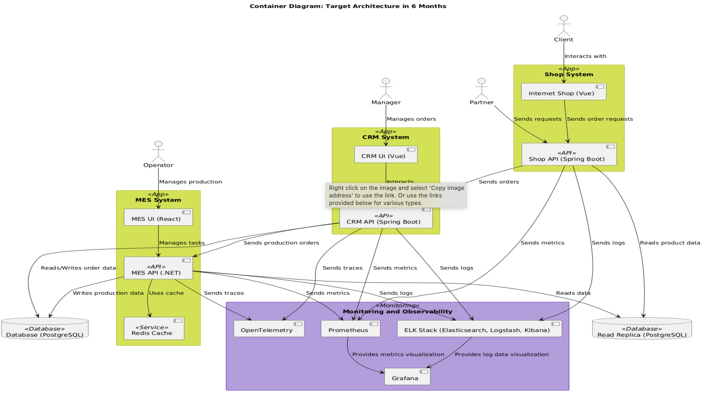
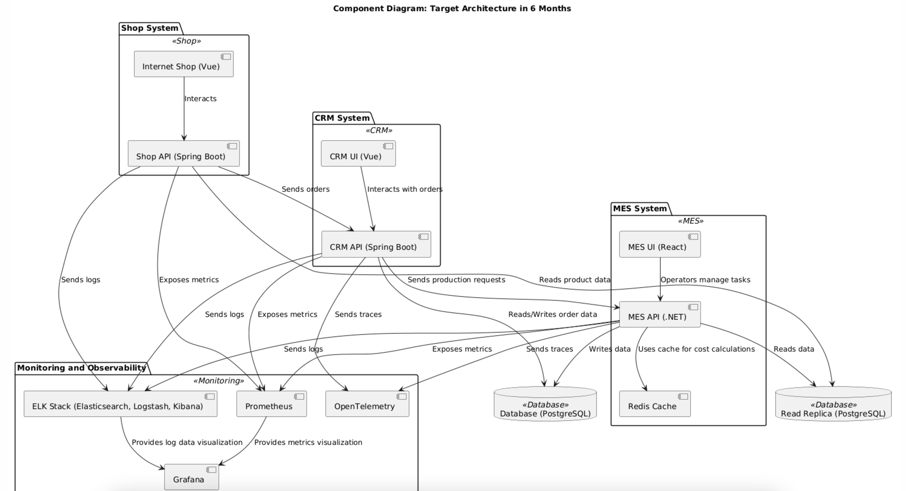

# Проблемы в порядке приоритета (и типизацией)

## 1. Бизнес

1. **Долгий срок выполнения заказов, заведённых через интернет-магазин:**
    - Клиенты недовольны длительным ожиданием, что снижает их лояльность и количество повторных заказов.

2. **Долгий срок выполнения заказов через API:**
    - Партнёры жалуются на низкую скорость обработки, что подрывает доверие и снижает конкурентоспособность.

3. **Жалобы клиентов на задержки доставки заказов:**
    - Негативный клиентский опыт ухудшает репутацию компании и может привести к потере клиентов.

4. **Долгая загрузка списка заказов в приложении MES:**
    - Низкая производительность MES снижает эффективность работы операторов, замедляя выполнение заказов.

---

## 2. QA

5. **Функциональное тестирование проводится вручную:**
    - Ручное тестирование увеличивает вероятность пропуска дефектов, особенно в условиях высокой нагрузки.

6. **Проверки нефункциональных требований (например, работы под нагрузкой) не проводятся:**
    - Система может выйти из строя при пиковых нагрузках, что создаёт риски сбоев в бизнес-процессах.

7. **Отсутствие нагрузочного тестирования для MES:**
    - Система не проверяется на масштабируемость, что приводит к проблемам при росте числа пользователей.

---

## 3. Девопс

8. **Ручные операции при деплое в release и prod среды:**
    - Высокая вероятность ошибок из-за человеческого фактора замедляет выпуск новых функций.

9. **Отсутствие автоматизации в процессе CI/CD:**
    - Увеличивает время развертывания и риск ошибок при обновлениях.

---

## 4. Базы данных

10. **Базы данных имеют один инстанс для чтения и записи:**
    - Узкое место в архитектуре, мешающее масштабированию.

11. **Нет кэширования, из-за этого создаётся большая нагрузка на базы данных:**
    - Система теряет производительность, увеличивая время обработки запросов.

12. **Высокая нагрузка на базу данных во время расчёта стоимости заказов:**
    - Приводит к задержкам в выполнении операций и сбоям.

---

## 5. Наблюдаемость

13. **Нет инструментов для анализа причин бизнес-проблем на prod-среде:**
    - Сложно выявлять причины инцидентов, что увеличивает время их устранения.

14. **Отсутствие централизованного логирования:**
    - Диагностика ошибок затруднена, что приводит к увеличению времени решения инцидентов.

15. **Нет системы трейсинга:**
    - Невозможно отследить путь заказов через компоненты, что затрудняет поиск узких мест.

---

## Обоснование приоритета

1. **Бизнес-проблемы** ставятся на первое место, так как они непосредственно влияют на доход, клиентский опыт и репутацию компании.
2. **QA-проблемы** важны для предотвращения ошибок и повышения качества системы.
3. **Девопс-проблемы** критичны для повышения скорости и надёжности разработки и развертывания.
4. **Проблемы с базой данных** влияют на производительность системы и требуют оптимизации для масштабирования.
5. **Наблюдаемость** является вспомогательной категорией, но она важна для мониторинга и диагностики.

# Инициативы для устранения нежелательных ситуаций

## Инициативы:

1. **Оптимизация производительности MES:**
    - Внедрение кэширования (например, Redis) для уменьшения времени обработки заказов.
    - Проведение анализа производительности и устранение узких мест в MES.
    - Внедрение паттерна Backpressure для регулирования нагрузки на MES, чтобы минимизировать репутационные потери и предотвращать перегрузки системы.

2. **Настройка системы мониторинга и трейсинга:**
    - Внедрение Prometheus и Grafana для отслеживания ключевых метрик производительности.
    - Настройка трейсинга (например, OpenTelemetry) для детального анализа пути заказов.
    - Включение трассировки по бизнес-сущности (например, по ID заказа) для отслеживания его прохождения через все компоненты системы.
    - Добавление мониторинга метрик и логирования с привязкой к ID заказа для детального анализа причин проблем.

3. **Централизованное логирование:**
    - Развертывание стека ELK (Elasticsearch, Logstash, Kibana) для сбора и анализа логов.
    - Обеспечение логирования всех ключевых событий с указанием ID заказов для упрощения поиска и устранения проблем.

4. **Улучшение API и его производительности:**
    - Добавление кэширования на уровне API для уменьшения нагрузки на базу данных.
    - Оптимизация запросов и снижение времени отклика.
    - Ограничение создания новых заказов через интернет-магазин и API с использованием паттерна Backpressure для предотвращения перегрузок системы.

5. **Автоматизация CI/CD:**
    - Настройка пайплайнов для автоматического тестирования и деплоя.
    - Включение этапов проверки кода на производительность и нагрузочные тесты в CI/CD процесс.

6. **Разработка сценариев нагрузочного тестирования:**
    - Автоматизация функционального и нагрузочного тестирования для MES и API.
    - Создание нагрузочных тестов для проверки устойчивости системы при увеличении заказов.

7. **Реорганизация базы данных:**
    - Внедрение паттерна read-write replica для снижения нагрузки на основную базу данных.
    - Оптимизация запросов и индексов для повышения производительности.
    - Разделение потоков чтения и записи для масштабируемости.

8. **Обновление интерфейса MES:**
    - Ускорение загрузки данных для операторов, использование пейджинга и оптимизация запросов.
    - Улучшение UX для повышения эффективности работы операторов.

---

## Приоритет инициатив

1. **Настройка системы мониторинга и трейсинга:**
    - *Почему?* Это основа для наблюдаемости системы. Позволяет выявлять узкие места, расследовать причины исчезновения заказов и быстрее реагировать на проблемы.

2. **Оптимизация производительности MES:**
    - *Почему?* Устранение задержек в обработке заказов значительно улучшит клиентский опыт. Внедрение Backpressure минимизирует риск репутационных потерь из-за перегрузки.

3. **Централизованное логирование:**
    - *Почему?* Логирование поможет лучше диагностировать причины проблем в системе и ускорит расследование инцидентов.

4. **Улучшение API и его производительности:**
    - *Почему?* Снизит нагрузку на базу данных, предотвратит перегрузки и ускорит взаимодействие партнёров.

5. **Реорганизация базы данных:**
    - *Почему?* Внедрение read-write replica устранит узкое место базы данных и ускорит выполнение операций.

6. **Разработка сценариев нагрузочного тестирования:**
    - *Почему?* Это необходимо для обеспечения стабильности системы под увеличенной нагрузкой и предотвращения сбоев.

7. **Автоматизация CI/CD:**
    - *Почему?* Ускорит выпуск новых версий и минимизирует ошибки при деплое.

8. **Обновление интерфейса MES:**
    - *Почему?* Улучшение UX для операторов повысит их эффективность и ускорит обработку заказов.

---

## Дополнительные элементы инициатив

1. **Внедрение паттерна Backpressure:**
    - Ограничить создание новых заказов через интернет-магазин и API в случае перегрузки системы. Это предотвратит перегрузки MES и базы данных, минимизируя репутационные риски.

2. **Интеграция инструментов наблюдаемости:**
    - Трассировка заказов, мониторинг метрик и логирование с привязкой к ID заказов позволят эффективно расследовать причины исчезновения заказов на прод среде.

3. **Реализация read-write replica для базы данных:**
    - Снизит нагрузку на основную базу данных, разделяя потоки чтения и записи. Это повысит производительность и обеспечит масштабируемость системы.

# Расстановка инициатив в порядке приоритета

## Ход рассуждений

Приоритет инициатив определяется их влиянием на ключевые бизнес-показатели, стабильность системы и улучшение клиентского опыта. Наиболее важные действия связаны с устранением узких мест в производительности и обеспечением наблюдаемости для быстрого выявления проблем.

---

## Приоритет инициатив

1. **Настройка системы мониторинга и трейсинга:**
    - *Почему?* Наблюдаемость является основой для анализа и устранения проблем. Это позволит отследить путь заказов через компоненты системы, быстрее находить и исправлять узкие места.
    - *Детали реализации:*
        - Внедрение Prometheus и Grafana для мониторинга метрик.
        - Настройка трейсинга через OpenTelemetry для анализа процессов по ID заказа.
        - Интеграция метрик и логов для устранения причин исчезновения заказов.

2. **Оптимизация производительности MES:**
    - *Почему?* Улучшение производительности MES напрямую влияет на скорость выполнения заказов и удовлетворённость клиентов.
    - *Детали реализации:*
        - Внедрение Redis для кэширования, чтобы ускорить обработку заказов.
        - Анализ и устранение узких мест в работе MES.
        - Внедрение паттерна Backpressure для управления нагрузкой и минимизации репутационных рисков.

3. **Централизованное логирование:**
    - *Почему?* Логирование помогает быстрее диагностировать проблемы, особенно при работе с большим количеством заказов.
    - *Детали реализации:*
        - Развёртывание стека ELK (Elasticsearch, Logstash, Kibana).
        - Логирование событий с привязкой к ID заказов для упрощения поиска причин инцидентов.

4. **Улучшение API и его производительности:**
    - *Почему?* Ускорение работы API снижает нагрузку на систему и улучшает взаимодействие с партнёрами.
    - *Детали реализации:*
        - Внедрение кэширования для уменьшения запросов к базе данных.
        - Ограничение создания заказов через API при перегрузках с помощью Backpressure.

5. **Реорганизация базы данных:**
    - *Почему?* Оптимизация базы данных снижает задержки и повышает масштабируемость системы.
    - *Детали реализации:*
        - Внедрение паттерна read-write replica для разгрузки основного инстанса.
        - Оптимизация запросов и индексов для повышения производительности.

6. **Разработка сценариев нагрузочного тестирования:**
    - *Почему?* Позволяет проверить устойчивость системы к растущим нагрузкам и выявить возможные проблемы до их появления.
    - *Детали реализации:*
        - Автоматизация нагрузочных тестов для MES и API.
        - Анализ стабильности системы при пиковых нагрузках.

7. **Автоматизация CI/CD:**
    - *Почему?* Ускоряет процесс разработки и развертывания, минимизируя ошибки при деплое.
    - *Детали реализации:*
        - Настройка пайплайнов CI/CD для автоматического тестирования и выпуска обновлений.

8. **Обновление интерфейса MES:**
    - *Почему?* Улучшение UX для операторов повышает их производительность и ускоряет выполнение заказов.
    - *Детали реализации:*
        - Внедрение пейджинга для ускорения загрузки данных.
        - Оптимизация запросов для повышения скорости интерфейса.

---

## Вид целевой архитектуры через полгода

1. **Система наблюдаемости:**
    - Настроены мониторинг (Prometheus, Grafana) и трейсинг (OpenTelemetry), позволяющие оперативно выявлять и устранять проблемы.

2. **Оптимизированная производительность MES:**
    - MES работает стабильно и обрабатывает заказы без задержек. Паттерн Backpressure предотвращает перегрузки.

3. **Централизованное логирование:**
    - Реализован стек ELK, который предоставляет удобный инструмент для анализа ошибок и поиска причин инцидентов.

4. **Оптимизированная база данных:**
    - Внедрён паттерн read-write replica, что увеличило масштабируемость и снизило нагрузку на основную базу.

5. **Автоматизация CI/CD:**
    - Обеспечен быстрый выпуск обновлений с минимизацией ошибок.

---

## Выбор трёх инициатив на ближайшие полгода

1. **Настройка системы мониторинга и трейсинга:**
    - *Почему?* Позволит быстро выявлять и устранять узкие места, обеспечивая стабильность системы.

2. **Оптимизация производительности MES:**
    - *Почему?* Решает ключевую проблему с задержкой выполнения заказов, улучшая клиентский опыт.

3. **Централизованное логирование:**
    - *Почему?* Ускоряет диагностику и исправление проблем, что критично при росте нагрузки.