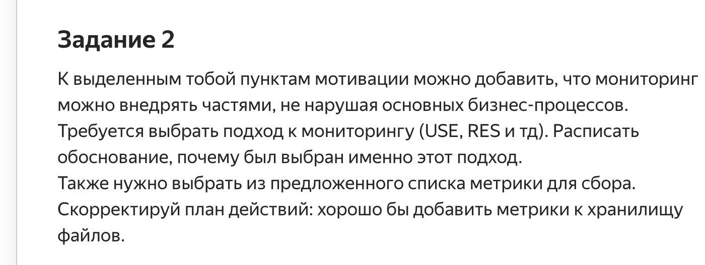

# Корректировка решения с учётом замечаний (исправленное)

# Дополнение мотивации

1. Мониторинг будет внедряться частями, чтобы не нарушать основные бизнес-процессы. Это обеспечит минимальное влияние на текущую работу системы, а также позволит поэтапно оценивать эффективность внедрённых решений.
2. На первом этапе мониторинг охватит основные критические компоненты: API, RabbitMQ, базы данных и хранилище файлов.

---

# Выбор подхода к мониторингу

## USE (Utilization, Saturation, Errors)
- **Почему выбран этот подход?**
    - USE идеально подходит для анализа состояния оборудования и производительности подсистем, таких как базы данных и RabbitMQ.
    - Подход фокусируется на выявлении узких мест и оценки загруженности, что критично для повышения устойчивости системы.
- **Применение:**
    - Используется для мониторинга базы данных (PostgreSQL), RabbitMQ и хранилища файлов (S3).

## RED (Rate, Errors, Duration)
- **Почему выбран этот подход?**
    - RED направлен на анализ API, что позволяет контролировать производительность и стабильность внешнего и внутреннего взаимодействия.
- **Применение:**
    - Применяется к API (Shop API, CRM API, MES API).

---

# Выбранные метрики

## RabbitMQ
- **Количество dead-letter сообщений (dead-letter-exchange)**  
  *(выбрано из картинки: “Number of dead-letter-exchange letters in RabbitMQ”)*
- **Количество сообщений в очереди (in-flight)**  
  *(выбрано из картинки: “Number of messages in flight in RabbitMQ”)*

## API
1. **Shop API**
    - RPS (запросы в секунду).  
      *(выбрано из картинки: “Number of requests (RPS) for internet shop API”)*
    - Среднее время ответа (latency).  
      *(выбрано из картинки: “Response time (latency) for shop API”)*
    - Количество HTTP-кодов 200 и 500.  
      *(выбрано из картинки: “Number of HTTP 200 for shop API” и “Number of HTTP 500 for shop API”)*
    - Количество одновременно активных сессий.  
      *(выбрано из картинки: “Number of simultaneous sessions for shop API”)*
    - Переданные/принятые данные (KB).  
      *(выбрано из картинки: “Kb transferred (received) for shop API” и “Kb provided (sent) for shop API”)*

2. **CRM API**
    - RPS (запросы в секунду).  
      *(выбрано из картинки: “Number of requests (RPS) for CRM API”)*
    - Среднее время ответа (latency).  
      *(выбрано из картинки: “Response time (latency) for CRM API”)*
    - Количество HTTP-кодов 200 и 500.  
      *(выбрано из картинки: “Number of HTTP 200 for CRM API” и “Number of HTTP 500 for CRM API”)*
    - Количество одновременно активных сессий.  
      *(выбрано из картинки: “Number of simultaneous sessions for CRM API”)*
    - Переданные/принятые данные (KB).  
      *(выбрано из картинки: “Kb transferred (received) for CRM API” и “Kb provided (sent) for CRM API”)*

3. **MES API**
    - RPS (запросы в секунду).  
      *(выбрано из картинки: “Number of requests (RPS) for MES API”)*
    - Среднее время ответа (latency).  
      *(выбрано из картинки: “Response time (latency) for MES API”)*
    - Количество HTTP-кодов 200 и 500.  
      *(выбрано из картинки: “Number of HTTP 200 for MES API” и “Number of HTTP 500 for MES API”)*
    - Количество одновременно активных сессий.  
      *(выбрано из картинки: “Number of simultaneous sessions for MES API”)*
    - Переданные/принятые данные (KB).  
      *(выбрано из картинки: “Kb transferred (received) for MES API” и “Kb provided (sent) for MES API”)*

## Базы данных
1. **Shop DB**
    - Утилизация CPU и памяти.  
      *(выбрано из картинки: “CPU % for shop API” и “Memory Utilisation for shop API”)*
    - Количество подключений.  
      *(выбрано из картинки: “Number of connections for shop db instance”)*
    - Размер базы данных.  
      *(выбрано из картинки: “Size of shop db instance”)*

2. **MES DB**
    - Утилизация CPU и памяти.  
      *(выбрано из картинки: “CPU % for MES API” и “Memory Utilisation for MES API”)*
    - Количество подключений.  
      *(выбрано из картинки: “Number of connections for MES db instance”)*
    - Размер базы данных.  
      *(выбрано из картинки: “Size of MES db instance”)*

## Хранилище файлов (S3)
- Размер используемого пространства.  
  *(выбрано из картинки: “Size of S3 storage”)*

---

# Корректировка плана действий

1. **Частичное внедрение мониторинга:**
    - Начать с ключевых API (Shop API, CRM API, MES API), которые оказывают наибольшее влияние на пользователей.
    - Добавить метрики RabbitMQ, чтобы отслеживать обработку сообщений.
    - Внедрить базовые метрики для базы данных и S3-хранилища.

2. **Поэтапное расширение:**
    - Постепенно подключать дополнительные метрики (например, распределение времени обработки по компонентам).
    - Настроить интеграцию метрик в Prometheus и визуализацию через Grafana.

3. **Установка алертинга:**
    - Настроить уведомления для превышения порогов RPS, latency и ошибок (HTTP 500).
    - Настроить алертинг для критических показателей RabbitMQ и баз данных.

если разбивать на этапы более подробно (будет так):

1. **Этап 1: Настройка базового мониторинга для критических подсистем:**
- Внедрить мониторинг для баз данных (PostgreSQL) и RabbitMQ с использованием подхода USE.
- Настроить Prometheus для сбора метрик CPU, памяти и времени отклика.

2. **Этап 2: Подключение API к мониторингу:**
- Настроить RED-подход для всех ключевых API.
- Собирать метрики RPS, Latency и HTTP-коды через OpenTelemetry и Prometheus.

3. **Этап 3: Мониторинг хранилища файлов:**
- Настроить метрики для S3: объём хранилища, запросы на чтение/запись, Latency.
- Включить хранилище в дашборды Grafana.

4. **Этап 4: Оптимизация и расширение:**
- Проанализировать собранные данные, выявить узкие места.
- Подключить дополнительные компоненты системы, если потребуется.

---

# Вывод

Плюсы такого типа внедрения:

- Постепенное внедрение минимизирует влияние на бизнес-процессы.
- Использование RED и USE позволяет покрыть все основные аспекты производительности системы.

Расширение мониторинга с учётом предложенных метрик позволит:
1. Повысить наблюдаемость и стабильность ключевых компонентов.
2. Быстро диагностировать и устранять узкие места в производительности.
3. Улучшить пользовательский опыт за счёт своевременного реагирования на проблемы.
