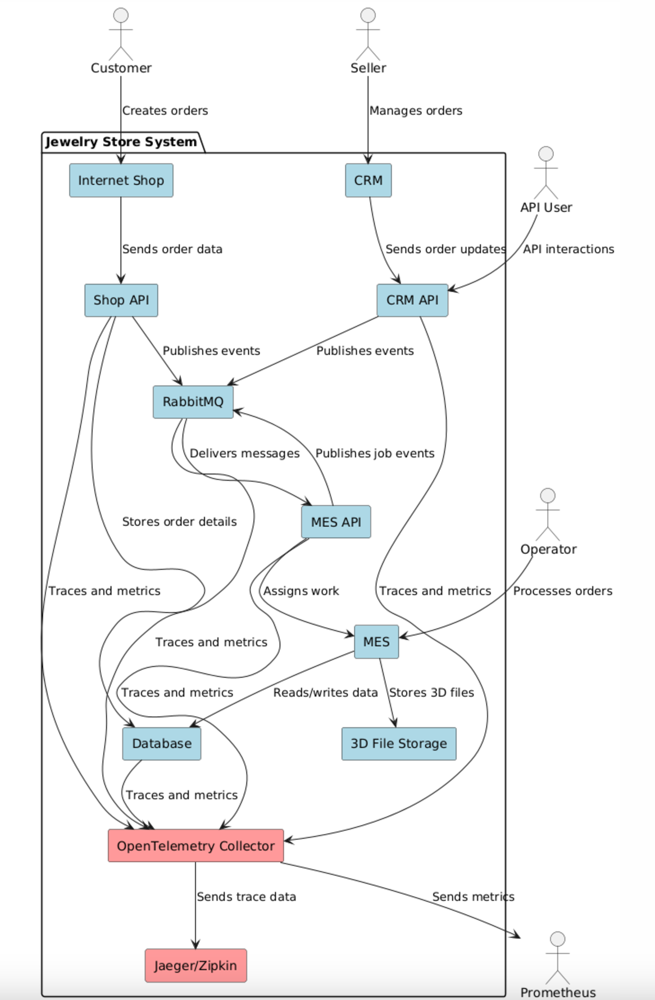
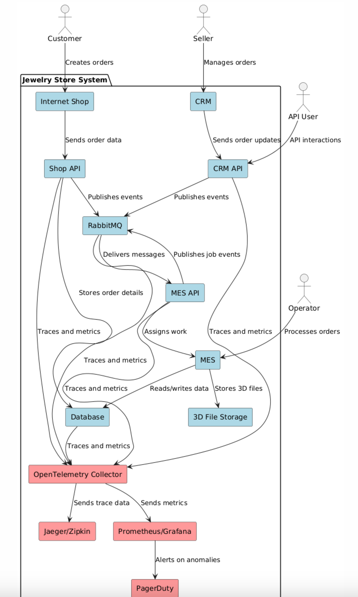

# Архитектурное решение по трейсингу

## 1. Анализ системы и добавление данных в трейсинг

### Слабые места для трейсинга:
1. **Shop API:**
    - Где может сломаться: долгий отклик при запросах.
    - Что добавить в трейсинг:
        - ID заказа.
        - Время начала и окончания обработки запроса.
        - HTTP-коды.
2. **CRM API:**
    - Где может сломаться: некорректная передача данных заказов в систему MES.
    - Что добавить в трейсинг:
        - ID заказа.
        - Статус передачи данных.
3. **RabbitMQ:**
    - Где может сломаться: перегрузка очередей или потеря сообщений.
    - Что добавить в трейсинг:
        - ID сообщения.
        - Время поступления сообщения в очередь.
        - Успешность доставки.
4. **MES API и MES:**
    - Где может сломаться: задержки в расчётах или обработке заказов.
    - Что добавить в трейсинг:
        - ID заказа.
        - Этап обработки (например, расчет стоимости, подтверждение, завершение).
5. **База данных:**
    - Где может сломаться: высокий уровень нагрузки на основной инстанс.
    - Что добавить в трейсинг:
        - Время выполнения запросов.
        - Используемые индексы.
        - Количество активных подключений.

---

## 2. Мотивация

**Почему нужен трейсинг?**
1. **Повышение наблюдаемости:**
    - Позволяет отследить весь путь заказа через систему и определить узкие места.
2. **Ускорение диагностики:**
    - Упрощает идентификацию источников проблем, таких как задержки в RabbitMQ или API.
3. **Улучшение клиентского опыта:**
    - Быстрое устранение ошибок повышает удовлетворённость пользователей.

**Метрики, на которые повлияет трейсинг:**
1. Среднее время выполнения заказа.
2. Уровень успешных запросов API (HTTP 200).
3. Время обработки сообщений RabbitMQ.

---

## 3. Предлагаемое решение

### Технологии:
1. **OpenTelemetry:**
    - Сбор трассировок по ключевым компонентам системы (API, RabbitMQ, база данных).
2. **Jaeger/Zipkin:**
    - Визуализация трассировок для анализа.
3. **Prometheus + Grafana:**
    - Мониторинг метрик, связанных с трейсингом.

### Изменения в системе:
1. **Shop API, CRM API, MES API:**
    - Добавление библиотек OpenTelemetry.
    - Логирование ID заказа и статусов операций.
2. **RabbitMQ:**
    - Интеграция с OpenTelemetry для отслеживания сообщений.
3. **База данных:**
    - Настройка трассировки SQL-запросов.

---

## 4. Доработанная C4-диаграмма

### Изменения:
- Добавлены компоненты OpenTelemetry, Jaeger/Zipkin.
- Выделены связи для трассировки (помечены красным).
- Расширена схема базы данных для отслеживания SQL-запросов.

Ссылка на диаграмму: [C4-диаграмма для трейсинга]

---

## 4.1. Раздел “Компромиссы”

### 4.1. Ограничения реализации трейcинга

- **Проприетарные системы:**
   - Некоторые системы в архитектуре могут не поддерживать стандартные форматы данных для интеграции с инструментами трейсинга. Например, MES API, работающий на C#, может потребовать кастомных изменений для передачи данных.

- **Стоимость модификации ПО:**
   - Внесение изменений в существующие системы, такие как RabbitMQ или базы данных, может потребовать существенных затрат, особенно если используется устаревшее оборудование или архитектура.

- **Высокая нагрузка на систему:**
   - Сбор детализированных логов и метрик может увеличить нагрузку на инфраструктуру, что приведёт к замедлению обработки запросов.

---

### 4.2. Случаи, когда трейcинг может быть неэффективен

- **Низкий уровень использования компонентов:**
   - Например, если Shop API редко используется, детализированный трейсинг для этого компонента может быть избыточным и не окупит вложенных ресурсов.

- **Отсутствие сложных сценариев:**
   - Если система не предполагает сложных бизнес-логик или сценариев, базового мониторинга может быть достаточно для обеспечения стабильности и диагностики.

---

### 4.3. Исключение телеметрии из CRM и MES

- **Причина:**
   - Сбор телеметрии из CRM и MES временно исключён из-за высокой стоимости их доработки. Основная цель трейсинга — выявление причин задержек и исчезновения заказов, а заказы не создаются непосредственно в этих двух подсистемах.

- **Альтернативное решение:**
   - Задержки или исчезновения заказов в CRM или MES будут выявлены на основании данных из смежных подсистем (например, Shop API или RabbitMQ). Такой подход позволяет сосредоточиться на критически важных компонентах, оптимизируя затраты.

## 4.2. Аспекты безопасности

## Основные меры безопасности:

1. **Внедрение аутентификации и авторизации:**
   - Только сотрудники компании с актуальной учётной записью и ролью "Поддержка" смогут получить доступ к системе трейсинга.
   - Обеспечивается защита от несанкционированного доступа.

2. **Шифрование данных:**
   - Все данные, передаваемые между компонентами системы трейсинга, шифруются (например, с использованием TLS), что исключает риск утечки информации.

3. **Ограничение доступа:**
   - Вход в систему трейсинга доступен только с внутренних IP-адресов компании или через VPN.
   - Внедряется ролевое разграничение доступа для сотрудников (например, только чтение логов или полный доступ к данным).

4. **Логирование действий пользователей:**
   - Все действия внутри системы трейсинга фиксируются в отдельной системе логов безопасности. Это позволяет оперативно выявлять подозрительные активности.

5. **Защита чувствительных данных:**
   - Логи и трассировки не содержат конфиденциальной информации о клиентах или заказах. Вся персональная информация удаляется или маскируется до записи в систему логирования.

---

## 5. Заключение

**Преимущества внедрения:**
- Снижение времени на поиск и устранение проблем.
- Улучшение пользовательского опыта.
- Повышение прозрачности системы для бизнеса.

Этот план обеспечит внедрение трейсинга и позволит устранить текущие проблемы с наблюдаемостью.

--

# Дополнительное задание: Автоматический мониторинг процесса прохождения заказа

## Реализация мониторинга и алертинга

Для обеспечения автоматического мониторинга процесса прохождения заказа и создания оповещений при отклонениях от ожидаемого поведения, необходимо выполнить следующие шаги:

### 1. Процесс трейсинга и мониторинга
- Настроить трейсинг для всех ключевых компонентов: `Shop API`, `CRM API`, `MES API`, и `RabbitMQ`.
- Включить сбор следующих метрик:
   - Время обработки заказа (end-to-end latency).
   - Метрики RPS и latency для каждого API.
   - Количество сообщений в `dead-letter exchange` в RabbitMQ.
   - Статусы HTTP (200, 500) для всех API.
- Автоматически связывать идентификаторы заказов с метриками для упрощения анализа.

### 2. Реализация алертинга
- Настроить пороговые значения метрик:
   - Если end-to-end latency превышает 5 минут, отправить уведомление DevOps.
   - Если количество ошибок (HTTP 500) превышает 5% запросов в течение 5 минут, отправить предупреждение.
   - Если очередь сообщений в RabbitMQ достигает критического уровня, генерировать сигнал тревоги.
- Реализовать интеграцию алертинга с инструментами, такими как PagerDuty или Slack.

### 3. Обновление C4-диаграммы
- Добавить новые элементы для отображения:
   - **Система мониторинга и алертинга (Prometheus, Grafana):** отображает ключевые метрики и диаграммы.
   - **Трассировка (OpenTelemetry):** позволяет отслеживать жизненный цикл заказа.
   - **Алертинг-система (PagerDuty):** получает сигналы об инцидентах и уведомляет ответственные команды.
- Отразить связи между компонентами мониторинга и существующими системами.

## Описание нового варианта диаграммы
Добавлены следующие изменения:
- Система мониторинга и алертинга подключена ко всем ключевым компонентам (`Shop API`, `CRM API`, `MES API`, `RabbitMQ`).
- Все новые элементы выделены **зелёным цветом** для удобства.

**Ссылка на обновлённую диаграмму:** [C4-диаграмма с мониторингом и алертингом].

