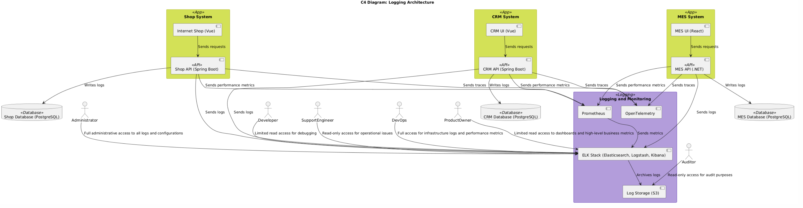

# Задание 4: Логирование и доступ к системным логам - корректировка

замечания

## C4-диаграмма и логирование
Для логирования систем в инфраструктуре используется центральная система сбора логов на основе **ELK Stack (Elasticsearch, Logstash, Kibana)**.

### Основные изменения:
1. Обновлены роли и распределение доступа:
    - **Administrator** добавлен как владелец полной административной роли, заменив Manager.
    - **Developer** теперь имеет ограниченный доступ, только для отладки.
2. Взаимодействие компонентов:
    - Все системные API (Shop API, CRM API, MES API) передают логи в **ELK Stack**.
    - Архивирование логов производится в **S3-хранилище**.
    - Логи дополнительно обогащаются трейсами через **OpenTelemetry**.
3. Новые роли:
    - **DevOps** добавлен для обеспечения мониторинга инфраструктуры и метрик производительности.
    - **Product Owner** имеет доступ только к высокоуровневым бизнес-метрикам через ELK.

### C4-Diagram

## Доступ к логам

### Роли и доступ:

1. **Developer (Разработчик):**
   - **Доступ:** Ограниченный доступ к логам через ELK (только чтение).
   - **Цели:**
      - Диагностика и исправление ошибок в пределах своего компонента.

2. **Support Engineer (Инженер поддержки):**
   - **Доступ:** Только чтение через ELK.
   - **Цели:**
      - Анализ и устранение операционных проблем.
      - Мониторинг метрик для предотвращения инцидентов.

3. **Administrator (Администратор):**
   - **Доступ:** Полный административный доступ к ELK.
   - **Цели:**
      - Управление настройками логирования.
      - Контроль прав доступа для других пользователей.

4. **Auditor (Аудитор):**
   - **Доступ:** Только чтение архивных логов через S3-хранилище.
   - **Цели:**
      - Выполнение аудита соответствия нормативным требованиям.
      - Анализ инцидентов для отчётности.

5. **DevOps:**
   - **Доступ:** Полный доступ к ELK.
   - **Цели:**
      - Управление инфраструктурными метриками и логами.
      - Мониторинг производительности системы.
      - Настройка и поддержка инструментов логирования и мониторинга.

6. **Product Owner (Владелец продукта):**
   - **Доступ:** Ограниченный доступ к ELK (чтение).
   - **Цели:**
      - Анализ ключевых бизнес-метрик.
      - Оценка влияния системы на бизнес-процессы.
      - Высокоуровневое понимание состояния системы.

---

## Обоснование распределения прав доступа:

- **Безопасность:** Чёткое разграничение прав минимизирует риски несанкционированного доступа или случайных изменений.
- **Прозрачность:** Упрощает управление доступом, позволяя каждой роли выполнять свои задачи.
- **Эффективность:** Все пользователи имеют доступ к необходимым данным, что снижает зависимость от администраторов.