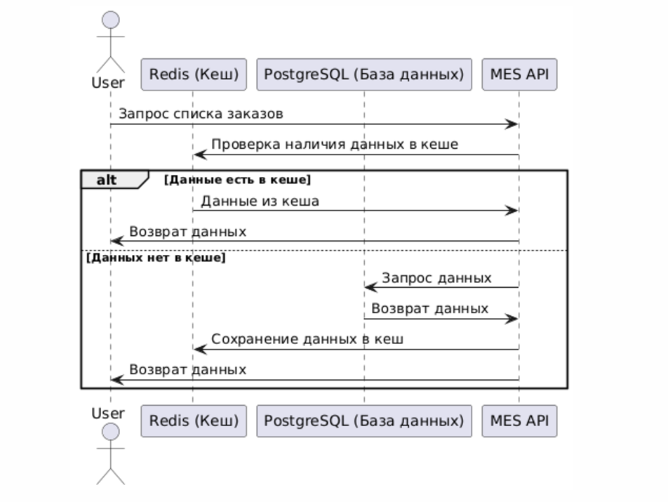

# Архитектурное решение по кешированию

## 1. Мотивация

Скорость работы приложения MES не удовлетворяет требованиям бизнеса и операторов. Для устранения проблемы предлагается внедрение серверного кеширования. Оно должно значительно уменьшить нагрузку на базу данных и ускорить время обработки запросов.

### Проблемы, которые решает кеширование:
- **Уменьшение времени чтения списка заказов.** Операции чтения заказов можно перенести в кеш, снизив нагрузку на базу данных.
- **Снижение времени обработки запросов.** Быстрый доступ к часто запрашиваемым данным позволяет ускорить время отклика системы.
- **Повышение производительности.** Кеширование позволит обрабатывать больше запросов за единицу времени.

## 2. Предлагаемое решение

### Тип кеширования:
- **Серверное кеширование** с использованием Redis.

### Паттерн:
- **Cache Aside.**
    - Данные читаются из кеша. Если данных нет, выполняется запрос в базу данных, после чего данные записываются в кеш.

### Стратегия инвалидации кеша:
- **Инвалидация по ключу.**
    - Данные в кеше обновляются только при изменении данных в базе данных. Это обеспечивает высокую точность данных при минимальной сложности реализации.

### Почему выбран именно Cache Aside:
- Простота реализации.
- Гибкость: подходит для работы с большим количеством запросов на чтение.
- Легкость контроля: кеш управляется на уровне приложений, что позволяет избегать сложных интеграций.

## 3. Процесс кеширования

1. Пользователь запрашивает список заказов.
2. Система проверяет наличие данных в кеше (Redis).
3. Если данные есть в кеше:
    - Они возвращаются пользователю.
4. Если данных нет в кеше:
    - Выполняется запрос в базу данных (PostgreSQL).
    - Результат сохраняется в кеше с ключом, соответствующим запросу.
5. В случае изменений в данных:
    - Обновляется соответствующий ключ в кеше или выполняется удаление устаревших данных.

## 4. Диаграмма последовательности (Sequence Diagram)

## 5. Инвалидация кеша

### Преимущества инвалидации по ключу:
- **Минимальная нагрузка на систему.** Только изменённые данные удаляются из кеша.
- **Точность данных.** Обеспечивается синхронизация между кешем и базой данных.

### Почему не выбраны другие стратегии:
- **Полная инвалидация:** приводит к увеличению задержек из-за повторной загрузки данных в кеш.
- **Программная инвалидация:** сложнее в реализации и требует дополнительной логики.

---

## 6. Вывод

Внедрение серверного кеширования с использованием паттерна **Cache Aside** и стратегии инвалидации по ключу позволяет:
- Ускорить доступ к данным.
- Снизить нагрузку на базу данных.
- Увеличить производительность приложения MES.

Такое решение является экономически эффективным и не требует значительных изменений в текущей архитектуре.