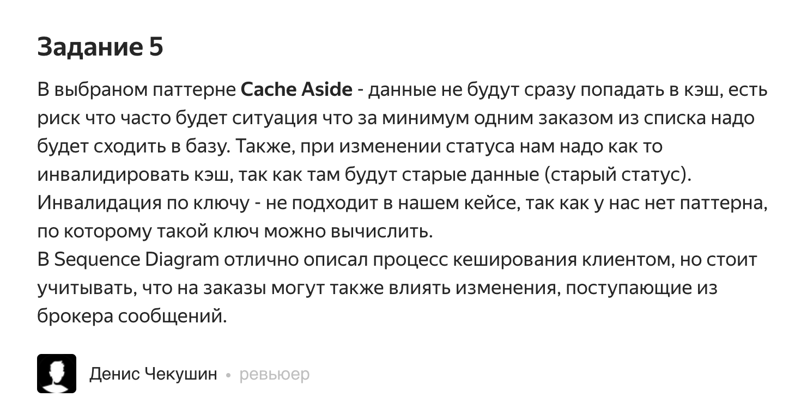
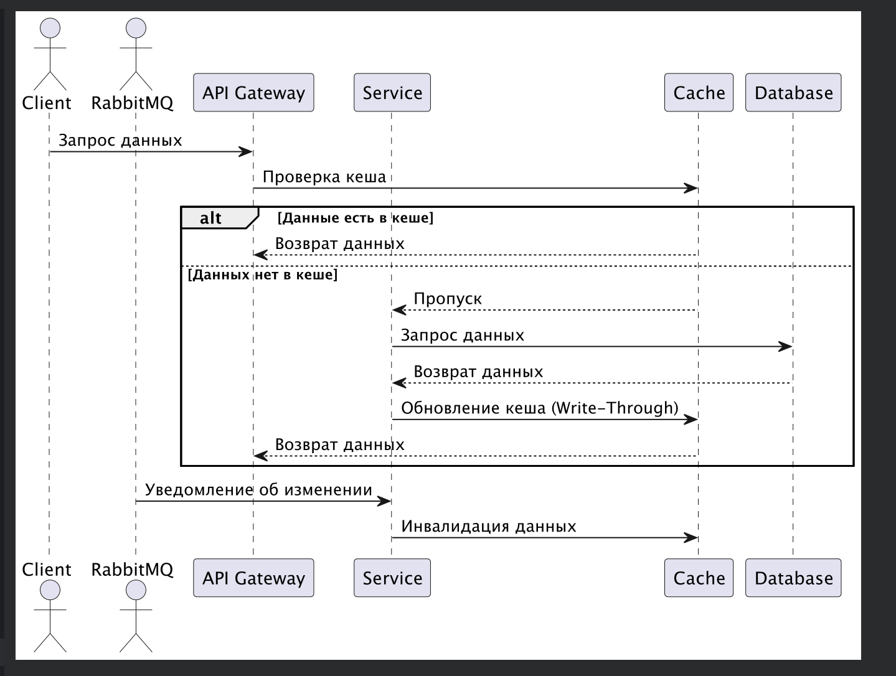

# Корректировка решения с учётом замечаний (исправленное)

# Решение замечаний

## 1. Решение проблемы с Cache Aside

### Проблемы:
- **Частые обращения к базе данных при отсутствии данных в кеше.**
- **Старение данных в кеше, особенно при изменении статусов заказов.**

### Предложения:
#### 1. Переход на паттерн Write-Through:
- **Описание:**
  Данные при записи в базу автоматически обновляются и в кеше.
- **Преимущества:**
    - Синхронизация данных между базой данных и кешем.
    - Исключение ситуации, когда в кеше хранятся устаревшие данные.
- **Недостатки:**
    - Высокая нагрузка на кеш при частых записях.

#### 2. Использование Refresh-Ahead:
- **Описание:**
  Данные проактивно обновляются в кеше на основании предиктивной логики.
- **Преимущества:**
    - Снижение задержек при запросах.
    - Улучшение пользовательского опыта.
- **Недостатки:**
    - Потенциальное перерасходование ресурсов кеша для данных, которые не используются.

#### 3. Комбинированное решение:
- Использование Write-Through для критических данных (например, изменения статусов заказов).
- Использование Cache Aside для редко изменяемых данных.

---

## 2. Вопрос про инвалидацию кеша

**Инвалидация по ключу** может быть неподходящей, если сложно вычислить конкретные ключи для данных.

### Решение:
#### 1. Программная инвалидация:
- **Описание:**
  Использование сообщений из брокера (RabbitMQ) для оповещения о необходимости инвалидации данных в кеше.
- **Пример:**
    - При изменении статуса заказа отправляется сообщение в очередь RabbitMQ, и соответствующий сервис обновляет или удаляет данные из кеша.
- **Преимущества:**
    - Точная синхронизация кеша с изменениями в базе данных.
- **Недостатки:**
    - Увеличение сложности системы.

#### 2. Временная инвалидация (Time-to-Live, TTL):
- **Описание:**
  Установка временных ограничений на хранение данных в кеше.
- **Пример:**
    - Данные заказов автоматически удаляются через определённое время.
- **Преимущества:**
    - Простота реализации.
- **Недостатки:**
    - Возможны задержки в обновлении данных.

---

## 3. Обновлённая Sequence Diagram

### Изменения:
1. Добавлен поток обработки сообщений из RabbitMQ для управления кешем.
2. Уточнён процесс записи в кеш:
    - При записи в базу данных данные сразу записываются в кеш (Write-Through).
3. Включена логика временной инвалидации для неактуальных данных.

## Описание изменений

## 1. RabbitMQ как инициатор изменений:
- **Описание:**
    - При изменении статуса заказа RabbitMQ отправляет уведомление в соответствующий сервис.
    - Сервис инвалидации обрабатывает это уведомление и удаляет или обновляет данные в кеше.
- **Преимущества:**
    - Гарантируется синхронизация данных между кешем и базой данных.
    - Снижается вероятность работы с устаревшими данными.

## 2. Write-Through для критических данных:
- **Описание:**
    - Критические данные, такие как статусы заказов, при изменении записываются одновременно в базу данных и кеш.
- **Преимущества:**
    - Исключается расхождение между кешем и базой данных.
    - Ускоряется обработка запросов к этим данным.

## 3. TTL для второстепенных данных:
- **Описание:**
    - Для второстепенных данных устанавливается Time-to-Live (TTL), что позволяет им автоматически устаревать через определённое время.
- **Преимущества:**
    - Снижается вероятность использования устаревших данных.
    - Обеспечивается автоматическая очистка кеша для редко запрашиваемой информации.
  
попробовал указать на диаграмме компонент

